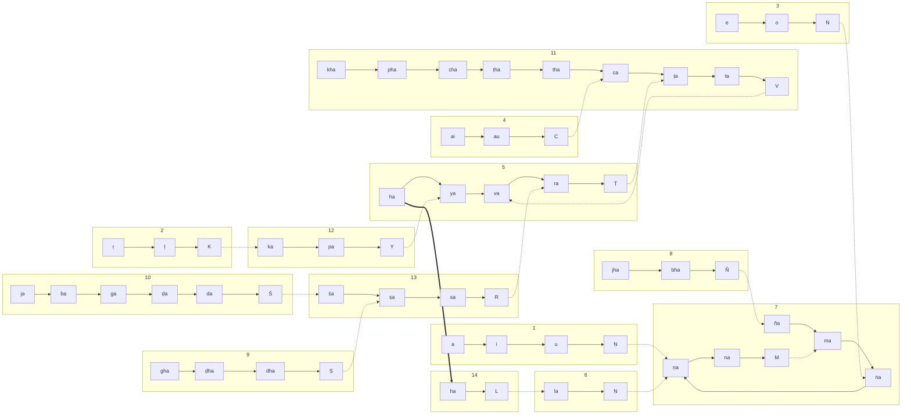
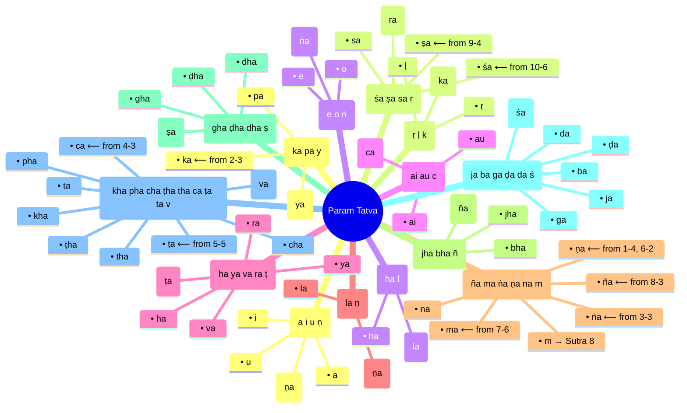

# Param Tatva from Maheshwara Sutras

A full Markdown explainer showing how Param Tatva emerges from the **14 Maheshwara Sutras**, with **two levels of continuation**:

1. **Primary Continuation (Prathama Srota)** – Each sutra’s **anubandha** (marker) links to the **first sound of the next sutra**.
2. **Secondary Continuation (It-Pratyaya Srota)** – Each sutra’s **anubandha** connects to specific other sutra positions (not always 7‑4). The mapping is explicit and finite.

---

## Maheshwar Sutra
1. अ इ उ ण् (7)
2. ऋ ऌ क् (12)
3. ए ओ ङ् (7)
4. ऐ औ च् (11)
5. ह य व र ट् (11)
6. ल ण् (7)
7. ञ म ङ ण न म् (7)
8. झ भ ञ् (7)
9. घ ढ ध ष् (13)
10. ज ब ग ड द श् (13)
11. ख फ छ ठ थ च ट त व् (5)
12. क प य् (5)
13. श ष स र् (5)
14. ह ल् (6)

When observed closely, you can see that each of the sutras are ending with an IT-pratyay(इत प्रत्यय - हलंत ). We connect these halant letters to their full forms wherever they appear in the sutras. This way, the maheshwar sutra transforms from 14 separate set of sutras to one unit called positive half of param tatva. The negative half of param tatva has the same shape but the sound energy moves in opposite direction. We posit that this param tatva is the primordial energy system of the universe, that excites from sound to become matter and forces, and exists through different excitation states in universe.  Thus to build the param tatva, the below mentioned secondary continuation mapping provides the specific connection map of maheshwar sutra locations(Sutra number - Alphabet location). 

## Secondary Continuation Mapping

According to the system:

* 1‑4 (ṇ) → 7‑4 (ṇa)
* 2‑3 (k) → 12‑1 (ka)
* 3‑3 (ṅ) → 7‑3 (ṅa)
* 4‑3 (c) → 11‑6 (ca)
* 5‑5 (ṭ) → 11‑7 (ṭa)
* 6‑2 (ṇ) → 7‑4 (ṇa)
* 7‑6 (m) → 7‑2 (ma)
* 8‑3 (ñ) → 7‑1 (ña)
* 9‑4 (ṣ) → 13‑2 (ṣa)
* 10‑6 (ś) → 13‑1 (śa)
* 11‑9 (v) → 5‑3 (va)
* 12‑3 (y) → 5‑2 (ya)
* 13‑4 (r) → 5‑4 (ra)
* (5)14‑2 (l) → 6‑1 (la)

---



## Primary Anubandha (Serial Connection)



## Secondary Anubandha (Cyclic & Directional Graph Connection)

```mermaid
mindmap
  root((Param Tatva))
    Sutra 1: a i u ṇ
      a
      i
      u
      ṇ (→ Sutra 2, and → 7‑4 ṇa)
    Sutra 2: ṛ ḷ k
      ṛ
      ḷ
      k (→ Sutra 3, and → 12‑1 ka)
    Sutra 3: e o ṅ
      e
      o
      ṅ (→ Sutra 4, and → 7‑3 ṅa)
    Sutra 4: ai au c
      ai
      au
      c (→ Sutra 5, and → 11‑6 ca)
    Sutra 5: ha ya va ra ṭ
      ha
      ya
      va
      ra
      ṭ (→ Sutra 6, and → 11‑7 ṭa)
    Sutra 6: la ṇ
      la
      ṇ (→ Sutra 7, and → 7‑4 ṇa)
    Sutra 7: ña ma ṅa ṇa na m
      ña (target of 8‑3)
      ma (target of 7‑6)
      ṅa (target of 3‑3)
      ṇa (target of 1‑4, 6‑2)
      na
      m (→ Sutra 8)
    Sutra 8: jha bha ñ
      jha
      bha
      ñ (→ Sutra 9, and → 7‑1 ña)
    Sutra 9: gha ḍha dha ṣ
      gha
      ḍha
      dha
      ṣ (→ Sutra 10, and → 13‑2 ṣa)
    Sutra 10: ja ba ga ḍa da ś
      ja
      ba
      ga
      ḍa
      da
      ś (→ Sutra 11, and → 13‑1 śa)
    Sutra 11: kha pha cha ṭha tha ca ṭa ta v
      kha
      pha
      cha
      ṭha
      tha
      ca (target of 4‑3)
      ṭa (target of 5‑5)
      ta
      v (→ Sutra 12, and → 5‑3 va)
    Sutra 12: ka pa y
      ka (target of 2‑3)
      pa
      y (→ Sutra 13, and → 5‑2 ya)
    Sutra 13: śa ṣa sa r
      śa (target of 10‑6)
      ṣa (target of 9‑4)
      sa
      r (→ Sutra 14, and → 5‑4 ra)
    Sutra 14: ha l
      ha
      l (→ END, and → 6‑1 la)
````


```mermaid
%%{init: {
  "theme": "default",
  "themeCSS": "
    /* Base: animate every edge path (solid, within-sutra) */
    .mermaid .edgePath path {
      stroke-dasharray: 6 6;
      animation: flow 2.5s linear infinite;
    }
    /* Faster animation + lighter dash for cross-sutra links (we'll target by their autogenerated edge IDs) */
    .mermaid path[id$='n4-n24'],
    .mermaid path[id$='n7-n49'],
    .mermaid path[id$='n10-n23'],
    .mermaid path[id$='n13-n45'],
    .mermaid path[id$='n18-n46'],
    .mermaid path[id$='n20-n24'],
    .mermaid path[id$='n26-n22'],
    .mermaid path[id$='n29-n21'],
    .mermaid path[id$='n33-n53'],
    .mermaid path[id$='n39-n52'],
    .mermaid path[id$='n48-n16'],
    .mermaid path[id$='n51-n15'],
    .mermaid path[id$='n55-n17'],
    .mermaid path[id$='n57-n19'] {
      stroke-dasharray: 2 8 !important;
      animation: flowFast 1.2s linear infinite !important;
      opacity: 0.9;
    }
    /* Extra emphasis for the special ha ⇒ ha link */
    .mermaid path[id$='n14-n56'] {
      stroke-width: 3 !important;
      stroke-dasharray: 10 6 !important;
      animation: flowBold 1.6s linear infinite !important;
    }
    /* Keep arrowheads crisp; don’t animate markers themselves */
    .mermaid marker path { animation: none !important; }
    @keyframes flow { to { stroke-dashoffset: -24; } }
    @keyframes flowFast { to { stroke-dashoffset: -20; } }
    @keyframes flowBold { to { stroke-dashoffset: -28; } }
  "
}}%%
graph LR
  %% --- Line 1 ---
  subgraph "1"
    n1["a"] --> n2["i"] --> n3["u"] --> n4["Ṇ"]
  end
  %% --- Line 2 ---
  subgraph "2"
    n5["ṛ"] --> n6["ḷ"] --> n7["K"]
  end
  %% --- Line 3 ---
  subgraph "3"
    n8["e"] --> n9["o"] --> n10["Ṅ"]
  end
  %% --- Line 4 ---
  subgraph "4"
    n11["ai"] --> n12["au"] --> n13["C"]
  end
  %% --- Line 5 ---
  subgraph "5"
    n14["ha"] --> n15["ya"] --> n16["va"] --> n17["ra"] --> n18["Ṭ"]
  end
  %% --- Line 6 ---
  subgraph "6"
    n19["la"] --> n20["Ṇ"]
  end
  %% --- Line 7 ---
  subgraph "7"
    n21["ña"] --> n22["ma"] --> n23["ṅa"] --> n24["ṇa"] --> n25["na"] --> n26["M"]
  end
  %% --- Line 8 ---
  subgraph "8"
    n27["jha"] --> n28["bha"] --> n29["Ñ"]
  end
  %% --- Line 9 ---
  subgraph "9"
    n30["gha"] --> n31["ḍha"] --> n32["dha"] --> n33["Ṣ"]
  end
  %% --- Line 10 ---
  subgraph "10"
    n34["ja"] --> n35["ba"] --> n36["ga"] --> n37["ḍa"] --> n38["da"] --> n39["Ś"]
  end
  %% --- Line 11 ---
  subgraph "11"
    n40["kha"] --> n41["pha"] --> n42["cha"] --> n43["ṭha"] --> n44["tha"] --> n45["ca"] --> n46["ṭa"] --> n47["ta"] --> n48["V"]
  end
  %% --- Line 12 ---
  subgraph "12"
    n49["ka"] --> n50["pa"] --> n51["Y"]
  end
  %% --- Line 13 ---
  subgraph "13"
    n52["śa"] --> n53["ṣa"] --> n54["sa"] --> n55["R"]
  end
  %% --- Line 14 ---
  subgraph "14"
    n56["ha"] --> n57["L"]
  end

  %% Cross-sutra (dashed visually; animation handled via CSS selectors above)
  n4 -.-> n24
  n7 -.-> n49
  n10 -.-> n23
  n13 -.-> n45
  n18 -.-> n46
  n20 -.-> n24
  n26 -.-> n22
  n29 -.-> n21
  n33 -.-> n53
  n39 -.-> n52
  n48 -.-> n16
  n51 -.-> n15
  n55 -.-> n17
  n57 -.-> n19

  %% Special ha (bold)
  n14 ==> n56

```

---

## Full Sequence (Flowchart with Dual Continuation)

```mermaid
graph TD
  classDef marker fill:#f9f9f9,stroke:#bbb,stroke-dasharray:4 2;
  classDef second stroke:#ff3333,stroke-width:2px;

  %% Only showing continuation highlights
  m1[1‑4 ṇ]:::marker --> a4[2‑1 ṛ]
  m1 -.-> n7d[7‑4 ṇa]:::second

  m2[2‑3 k]:::marker --> a6[3‑1 e]
  m2 -.-> k12[12‑1 ka]:::second

  m3[3‑3 ṅ]:::marker --> a8[4‑1 ai]
  m3 -.-> n7c[7‑3 ṅa]:::second

  m4[4‑3 c]:::marker --> h5[5‑1 ha]
  m4 -.-> c11[11‑6 ca]:::second

  m5[5‑5 ṭ]:::marker --> l6[6‑1 la]
  m5 -.-> t11r[11‑7 ṭa]:::second

  m6[6‑2 ṇ]:::marker --> n7a[7‑1 ña]
  m6 -.-> n7d[7‑4 ṇa]:::second

  m7[7‑6 m]:::marker --> j8[8‑1 jha]
  m7 -.-> n7b[7‑2 ma]:::second

  m8[8‑3 ñ]:::marker --> g9[9‑1 gha]
  m8 -.-> n7a[7‑1 ña]:::second

  m9[9‑4 ṣ]:::marker --> j10[10‑1 ja]
  m9 -.-> s13r[13‑2 ṣa]:::second

  m10[10‑6 ś]:::marker --> kh11[11‑1 kha]
  m10 -.-> s13p[13‑1 śa]:::second

  m11[11‑9 v]:::marker --> k12[12‑1 ka]
  m11 -.-> v5[5‑3 va]:::second

  m12[12‑3 y]:::marker --> s13p[13‑1 śa]
  m12 -.-> y5[5‑2 ya]:::second

  m13[13‑4 r]:::marker --> h14[14‑1 ha]
  m13 -.-> r5[5‑4 ra]:::second

  m14[14‑2 l]:::marker --> END[END]
  m14 -.-> l6[6‑1 la]:::second
```

```mermaid
graph TD

  %% ===== Nodes by Sutra (sequential links inside each) =====
  subgraph L1["1: a i u ṇ"]
    a1["a"] --> a2["i"] --> a3["u"] --> m1["ṇ"]
  end

  subgraph L2["2: ṛ ḷ k"]
    a4["ṛ"] --> a5["ḷ"] --> m2["k"]
  end

  subgraph L3["3: e o ṅ"]
    a6["e"] --> a7["o"] --> m3["ṅ"]
  end

  subgraph L4["4: ai au c"]
    a8["ai"] --> a9["au"] --> m4["c"]
  end

  subgraph L5["5: ha ya va ra ṭ"]
    h5["ha"] --> y5["ya"] --> v5["va"] --> r5["ra"] --> m5["ṭ"]
  end

  subgraph L6["6: la ṇ"]
    l6["la"] --> m6["ṇ"]
  end

  subgraph L7["7: ña ma ṅa ṇa na m"]
    n7a["ña"] --> n7b["ma"] --> n7c["ṅa"] --> n7d["ṇa"] --> n7e["na"] --> m7["m"]
  end

  subgraph L8["8: jha bha ñ"]
    j8["jha"] --> b8["bha"] --> m8["ñ"]
  end

  subgraph L9["9: gha ḍha dha ṣ"]
    g9["gha"] --> d9r["ḍha"] --> d9["dha"] --> m9["ṣ"]
  end

  subgraph L10["10: ja ba ga ḍa da ś"]
    j10["ja"] --> b10["ba"] --> g10["ga"] --> d10r["ḍa"] --> d10["da"] --> m10["ś"]
  end

  subgraph L11["11: kha pha cha ṭha tha ca ṭa ta v"]
    kh11["kha"] --> ph11["pha"] --> ch11["cha"] --> th11r["ṭha"] --> th11["tha"] --> c11["ca"] --> t11r["ṭa"] --> t11["ta"] --> m11["v"]
  end

  subgraph L12["12: ka pa y"]
    k12["ka"] --> p12["pa"] --> m12["y"]
  end

  subgraph L13["13: śa ṣa sa r"]
    s13p["śa"] --> s13r["ṣa"] --> s13d["sa"] --> m13["r"]
  end

  subgraph L14["14: ha l"]
    h14["ha"] --> m14["l"]
  end

  %% ===== Primary continuation (marker -> first of next sutra) =====
  m1 --> a4
  m2 --> a6
  m3 --> a8
  m4 --> h5
  m5 --> l6
  m6 --> n7a
  m7 --> j8
  m8 --> g9
  m9 --> j10
  m10 --> kh11
  m11 --> k12
  m12 --> s13p
  m13 --> h14
  m14 --> END[END]

  %% ===== Secondary continuation (exact mapping you gave) =====
  %% 1-4 (ṇ) → 7-4 (ṇa)
  m1 --> n7d
  %% 2-3 (k) → 12-1 (ka)
  m2 --> k12
  %% 3-3 (ṅ) → 7-3 (ṅa)
  m3 --> n7c
  %% 4-3 (c) → 11-6 (ca)
  m4 --> c11
  %% 5-5 (ṭ) → 11-7 (ṭa)
  m5 --> t11r
  %% 6-2 (ṇ) → 7-4 (ṇa)
  m6 --> n7d
  %% 7-6 (m) → 7-2 (ma)
  m7 --> n7b
  %% 8-3 (ñ) → 7-1 (ña)
  m8 --> n7a
  %% 9-4 (ṣ) → 13-2 (ṣa)
  m9 --> s13r
  %% 10-6 (ś) → 13-1 (śa)
  m10 --> s13p
  %% 11-9 (v) → 5-3 (va)
  m11 --> v5
  %% 12-3 (y) → 5-2 (ya)
  m12 --> y5
  %% 13-4 (r) → 5-4 (ra)
  m13 --> r5
  %% (5)14-2 (l) → 6-1 (la)
  m14 --> l6

  %% ===== Special pedagogical link: ha(5) → ha(14) =====
  h5 --> h14

```





---

## Notes

* **Primary Continuity**: as before, anubandhas → first sound of next sutra.
* **Secondary Continuity**: now mapped explicitly per the tradition (see mapping list).
* Sutras 5 and 14 overlap in “ha” and “la”, creating a cyclic loop.
* This dual layering reflects **cyclic resonance** of sounds in Param Tatva.
