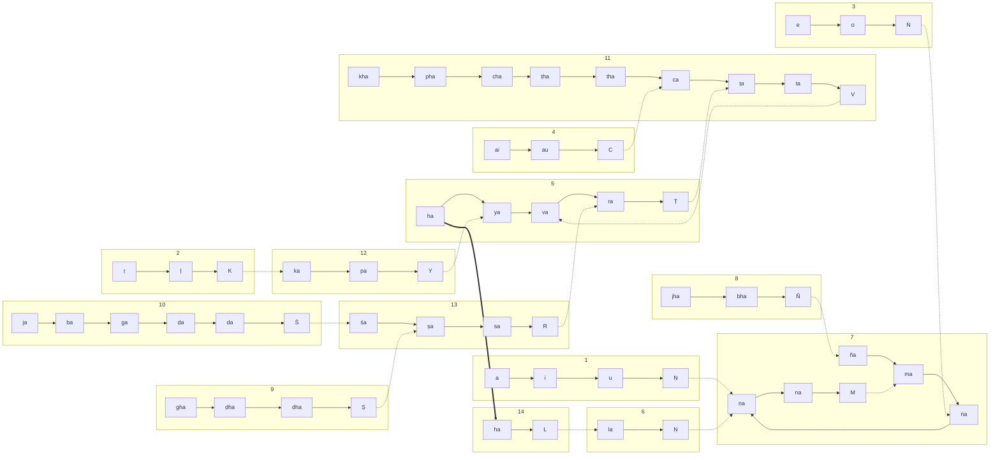

Here’s a Mermaid diagram built directly from your attached JSON (nodes grouped by sutra line; solid arrows are within-line order, dashed arrows are cross-sutra references, and the bold arrow is the special ha→ha link):

