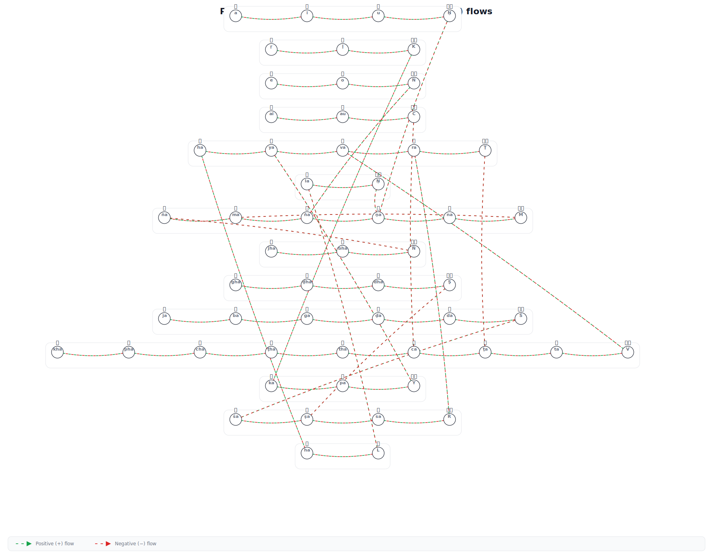
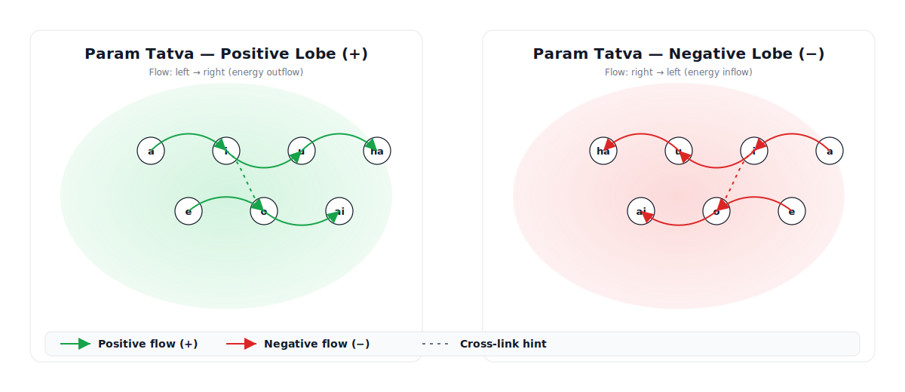

# 卐 Param Tatva Simulation 卍

**Question:** How did the universe come into existence—and how does it keep doing so?
**Answer:** Let’s find out.

## What is [Param Tatva](/param_tatva_from_maheshwara_sutra.md)?
**Param Tatva Simulation** is a unifying playground inspired by string theory where **Param Tatva** (the fundamental string) gives rise to both **particles** and **forces**, with a lightweight **detector** stack to visualize outcomes.&#x20;


<br/>


## Purpose - Generation and detection of particles and forces from Paramtatva.



---

[](https://docs.paramtatva.org)
[](https://github.com/ParamTatva-org/param-tatva-sim/actions/workflows/tests.yml)


## ✨ What’s inside

* **Detector simulator**

  * **Simplified mode**: fast, pedagogical EM shower (Gamma longitudinal + Gaussian lateral).
  * **Accurate mode**: PDG-inspired longitudinal profile, two-Gaussian Molière lateral spread, and photostatistics digitization.

* **Forces module**

  * EM transport (Lorentz force in uniform E/B).
  * Force potentials: **Coulomb** $1/r$, **Yukawa** $e^{-mr}/r$, and **string** $κr$.
  * Toy **QCD color flux tube** visualizer.

* **ParamSūtra configs** (YAML) to switch modes/material presets.

* **pt-core (Rust)**: compiles to a library with:

  * Toy open/closed string mass² relations, **KK+winding on T²**, linear charge map.
  * **Unit tests** (potential monotonicity, KK symmetry).
  * **Criterion benchmarks** (KK+winding grid).
  * Optional **pyo3** Python bindings (`pt_core_py`) for speed-ups.

---

## 📂 Repository structure

```
param-tatva-sim-all/
├─ pt-core/                     # Rust core (spectrum, compactification, potentials)
│  ├─ Cargo.toml
│  ├─ benches/core_bench.rs     # criterion benchmarks
│  ├─ src/
│  │  ├─ compact.rs             # KK + winding, charge map
│  │  ├─ params.rs              # PTParams (α', intercepts, radii, charge coeffs)
│  │  ├─ potentials.rs          # Coulomb/Yukawa/String potentials
│  │  ├─ spectrum.rs            # open/closed mass², level matching (toy)
│  │  ├─ states.rs              # state enumerator (mass, Q) from (level, m, w)
│  │  ├─ utils.rs
│  │  └─ pybindings.rs          # optional: pyo3 module (pt_core_py)
│  └─ tests/
│     ├─ compact_tests.rs
│     └─ potentials_tests.rs
├─ pt-sim/
│  ├─ pyproject.toml
│  └─ pt_sim/
│     ├─ __init__.py
│     ├─ paramsutra.py          # config loader + material & mode
│     ├─ physics/
│     │  ├─ simplified.py
│     │  └─ accurate.py
│     ├─ forces/
│     │  ├─ gauge.py
│     │  ├─ em.py
│     │  ├─ potentials.py
│     │  └─ qcd_toy.py
│     ├─ fastcore.py            # Python wrapper that prefers Rust if available
│     ├─ demo_run.py            # detector demo (simplified/accurate)
│     └─ demo_forces.py         # forces demo (EM spiral, potentials, flux tube)
├─ configs/
│  ├─ demo_electron.yaml              # simplified mode
│  └─ demo_electron_accurate.yaml     # accurate mode
├─ out/                          # generated artifacts (images, summaries)
└─ README.md
```

---

## 🧪 Requirements

* **Python** ≥ 3.9 (tested with 3.11)
* **pip** and a C toolchain (for optional native bindings)
* **Rust** ≥ 1.75 (for `pt-core`, tests/benches, and pyo3 bindings)
* (Optional) **virtualenv/conda** recommended

---

## 🚀 Quickstart (Python demos)

### 1) Install the Python package (editable)

```bash
cd pt-sim
python -m pip install -e .
```

### 2) Run the detector demos

**Simplified**

```bash
python -m pt_sim.demo_run ../configs/demo_electron.yaml ../out
```

**Accurate**

```bash
python -m pt_sim.demo_run ../configs/demo_electron_accurate.yaml ../out
```

Artifacts (under `out/`):

* `ecal_image_simplified.png`, `longitudinal_profile_simplified.png`, `summary_simplified.json`
* `ecal_image_accurate.png`, `longitudinal_profile_accurate.png`, `summary_accurate.json`

### 3) Run the forces demos

```bash
python -m pt_sim.demo_forces ../out
```

Artifacts:

* `force_lorentz_spiral.png` (electron spiral in uniform B)
* `force_potentials.png` (Coulomb/Yukawa/String)
* `force_flux_tube.png` (QCD-like flux tube)

---

## ⚡ Optional: Rust acceleration in Python (pyo3)

`pt-core` can export a tiny Python extension (`pt_core_py`) that speeds up inner loops (e.g., KK+winding mass²). A thin wrapper in `pt-sim/pt_sim/fastcore.py` will auto-use Rust if present, else fall back to Python.

**Build the extension:**

```bash
# from repo root
cd pt-core
cargo build --release --features python
```

On Linux/macOS, the built `.so` is under `target/release/`. On Windows, it’s a `.pyd`. Make it importable by Python (any one works):

* Add the build directory to `PYTHONPATH`,
* Or copy the built library next to `pt-sim/pt_sim/fastcore.py` as `pt_core_py.*`,
* Or install via `maturin` (future improvement).

**Verify:** re-run a detector demo; `fastcore` will call the Rust `kk_winding_mass2` once (no behavioral change, just a proof-of-work integration).

---

## 🧰 Using the Rust crate directly

Build & test:

```bash
cd pt-core
cargo build
cargo test
```

Run benchmarks (Criterion):

```bash
cargo bench
```

> Benchmarks currently time a KK+winding grid as a baseline for future GPU offloading.

---

## 🔬 State enumeration (toy)

`pt-core/src/states.rs` provides a small enumerator that returns `(mass, Q)` tuples by scanning `(level, m, w)` ranges (open string toy, tachyonic states dropped). You can wire this into Python next via pyo3 to get vectorized spectra directly into NumPy.

---

## 🗺 Roadmap

* Proton/neutron toy bound states from string potential; 2/3-body solvers.
* Tracker/HCAL/muon system stubs; particle-flow reconstruction.
* Parton shower + fragmentation toy.
* **maturin** packaging & CI: wheels for `pt_core_py` across platforms.
* GPU candidates & profiling (e.g., compactification loops).

---

## 📜 License

**Apache-2.0**

---

### Changelog highlights (latest)

* Upgraded `pt-core` with **tests**, **benches**, **pyo3 bindings**, and **state enumerator**.
* Added **forces** module (EM motion, potentials, flux tube).
* Detector supports **simplified** and **accurate** EM shower models and outputs.

**GitHub Actions** workflow:

* runs `cargo test` / (quick) `cargo bench`,
* builds a Python wheel with `maturin`,
* and runs the Python demos using the Rust-accelerated path.
