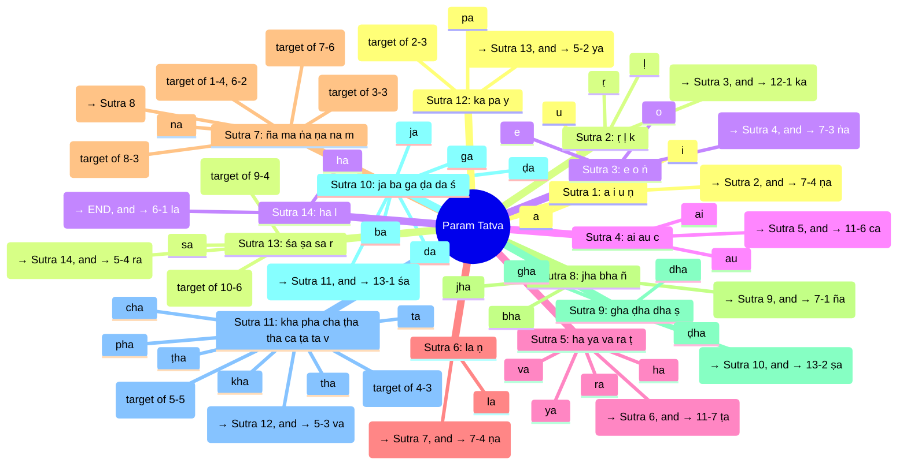

# Param Tatva from Maheshwara Sutras

A full Markdown explainer showing how Param Tatva emerges from the **14 Maheshwara Sutras**, with **two levels of continuation**:

1. **Primary Continuation (Prathama Srota)** – Each sutra’s **anubandha** (marker) links to the **first sound of the next sutra**.
2. **Secondary Continuation (It-Pratyaya Srota)** – Each sutra’s **anubandha** connects to specific other sutra positions. The mapping is explicit and finite.

---

## Secondary Continuation Mapping

According to the system:

* 1‑4 (ṇ) → 7‑4 (ṇa)
* 2‑3 (k) → 12‑1 (ka)
* 3‑3 (ṅ) → 7‑3 (ṅa)
* 4‑3 (c) → 11‑6 (ca)
* 5‑5 (ṭ) → 11‑7 (ṭa)
* 6‑2 (ṇ) → 7‑4 (ṇa)
* 7‑6 (m) → 7‑2 (ma)
* 8‑3 (ñ) → 7‑1 (ña)
* 9‑4 (ṣ) → 13‑2 (ṣa)
* 10‑6 (ś) → 13‑1 (śa)
* 11‑9 (v) → 5‑3 (va)
* 12‑3 (y) → 5‑2 (ya)
* 13‑4 (r) → 5‑4 (ra)
* (5)14‑2 (l) → 6‑1 (la)

---

## Overview (Mindmap)

---

## Full Sequence (Flowchart with Dual Continuation)

```mermaid
graph TD
  classDef marker fill:#f9f9f9,stroke:#bbb,stroke-dasharray:4 2;
  classDef second stroke:#ff3333,stroke-width:2px;

  %% Only showing continuation highlights
  m1[1‑4 ṇ]:::marker --> a4[2‑1 ṛ]
  m1 -.-> n7d[7‑4 ṇa]:::second

  m2[2‑3 k]:::marker --> a6[3‑1 e]
  m2 -.-> k12[12‑1 ka]:::second

  m3[3‑3 ṅ]:::marker --> a8[4‑1 ai]
  m3 -.-> n7c[7‑3 ṅa]:::second

  m4[4‑3 c]:::marker --> h5[5‑1 ha]
  m4 -.-> c11[11‑6 ca]:::second

  m5[5‑5 ṭ]:::marker --> l6[6‑1 la]
  m5 -.-> t11r[11‑7 ṭa]:::second

  m6[6‑2 ṇ]:::marker --> n7a[7‑1 ña]
  m6 -.-> n7d[7‑4 ṇa]:::second

  m7[7‑6 m]:::marker --> j8[8‑1 jha]
  m7 -.-> n7b[7‑2 ma]:::second

  m8[8‑3 ñ]:::marker --> g9[9‑1 gha]
  m8 -.-> n7a[7‑1 ña]:::second

  m9[9‑4 ṣ]:::marker --> j10[10‑1 ja]
  m9 -.-> s13r[13‑2 ṣa]:::second

  m10[10‑6 ś]:::marker --> kh11[11‑1 kha]
  m10 -.-> s13p[13‑1 śa]:::second

  m11[11‑9 v]:::marker --> k12[12‑1 ka]
  m11 -.-> v5[5‑3 va]:::second

  m12[12‑3 y]:::marker --> s13p[13‑1 śa]
  m12 -.-> y5[5‑2 ya]:::second

  m13[13‑4 r]:::marker --> h14[14‑1 ha]
  m13 -.-> r5[5‑4 ra]:::second

  m14[14‑2 l]:::marker --> END[END]
  m14 -.-> l6[6‑1 la]:::second
```

---

## Notes

* **Primary Continuity**: as before, anubandhas → first sound of next sutra.
* **Secondary Continuity**: now mapped explicitly per the tradition (see mapping list).
* Sutras 5 and 14 overlap in “ha” and “la”, creating a cyclic loop.
* This dual layering reflects **cyclic resonance** of sounds in Param Tatva.
* Sutra 7 has a self-loop as well.
* Sutra 5-11 also creates a larger loop.

